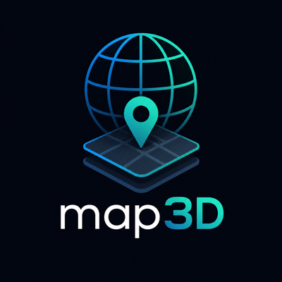
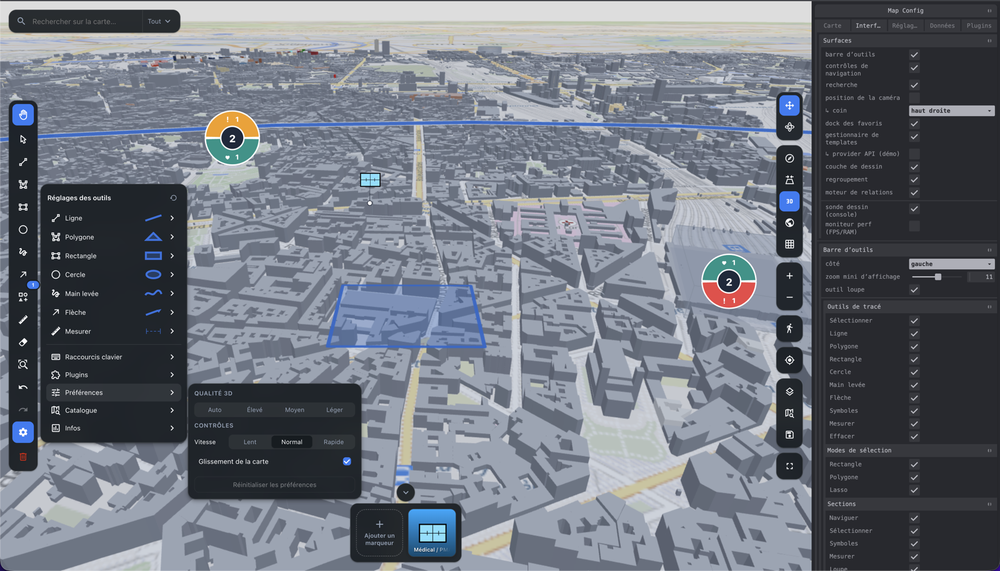
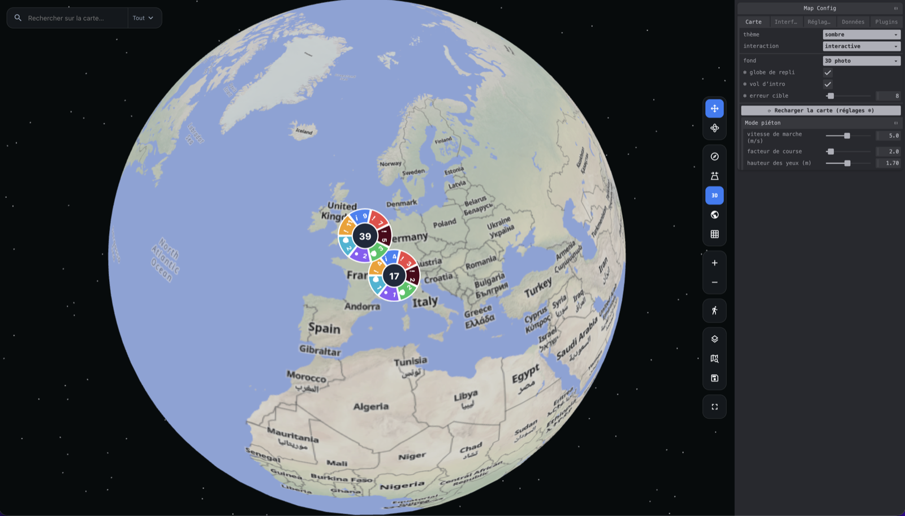
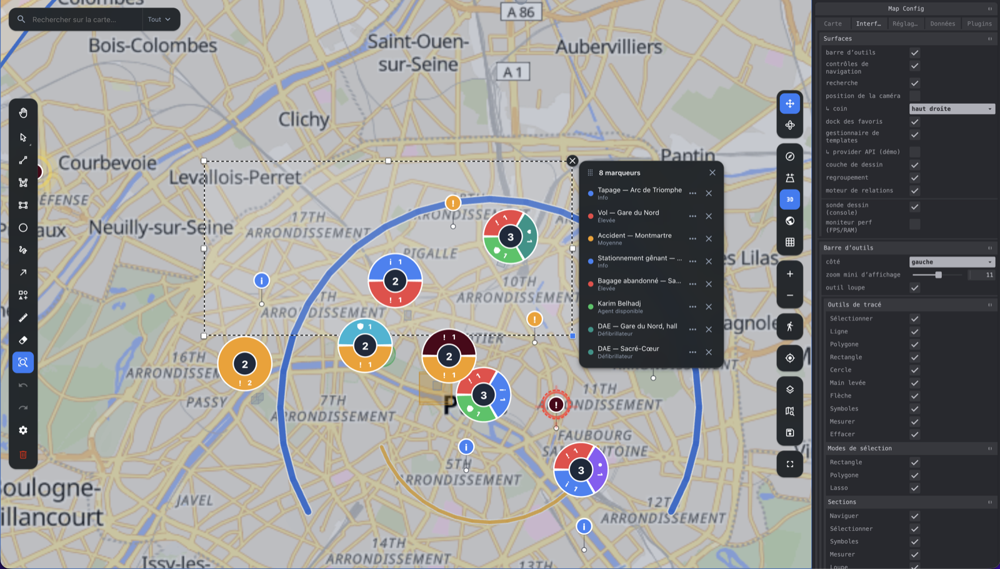
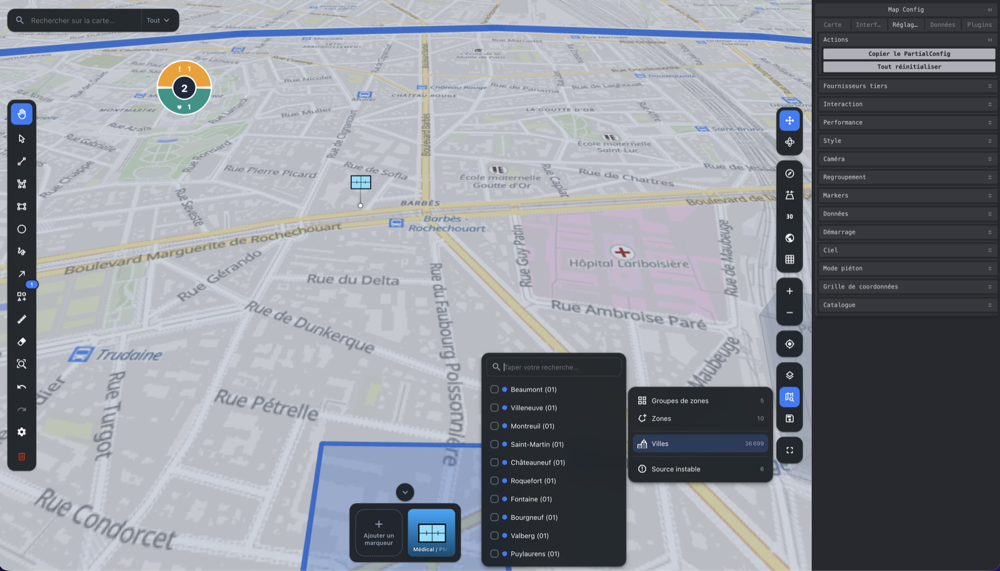
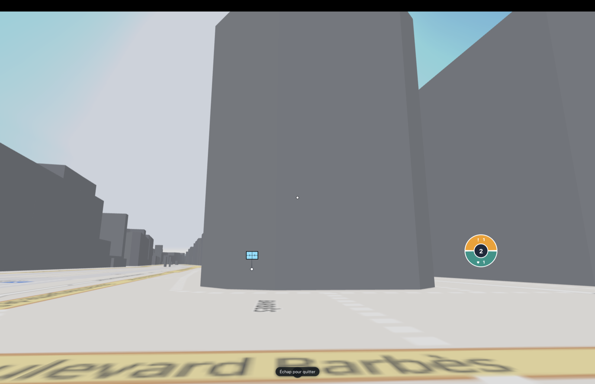

<div align="center">



### map3d — real-time 3D mapping for React: photorealistic globe, DOM markers, a Figma-style drawing editor, and live data.

*map3d — cartographie 3D temps réel pour React : globe photoréaliste, markers DOM, éditeur de dessin, données temps réel.*

[](https://react.dev)
[](https://threejs.org)
[](https://www.typescriptlang.org)
[](#build)
[](LICENSE)

**[Documentation 🇫🇷](docs/fr/README.md)** · **[Documentation 🇬🇧](docs/en/README.md)** · **[Plugins ↗](https://github.com/pasquelin/plugingsMap3D)**

<br/>



</div>

---

## Why map3d

An **imperative Three.js engine driven declaratively by React**. `MapEngine` owns the truth (camera, tiles, layers); React mounts it and stays out of the frame loop — so you get 60 fps on modest laptops without fighting re-renders.

- 🌐 **Photorealistic 3D → flat 2D**, one library. Google Photorealistic 3D Tiles (via Cesium Ion) with an ellipsoid-globe fallback when no token is set.
- 🧩 **Bring your own tiles.** The 2D basemap runs from Google *or* your self-hosted XYZ server — no key, no quota — switched by configuration alone.
- 📍 **DOM/CSS markers & clusters** with native `:hover`, accessibility and animations; pooled nodes, `translate3d` in a single write pass. Stable identity → a moving agent *glides* instead of being recreated.
- ✏️ **Full drawing editor**, Figma-style: marquee/lasso select, resize & rotate handles, per-tool styles, undo/redo, GeoJSON in/out.
- 🛰️ **Live, viewport-driven data**: bbox refetch on move + real-time updates.
- 🧭 **Coordinate graticule, tag relations, unified search, lens, pedestrian mode, MIL-STD-2525D symbology.**
- 🎨 **Typed light/dark theme** (`prefers-reduced-motion` honoured) and **100 % translatable** — no hard-coded string or value anywhere.

## Gallery

<table width="100%">
  <tr>
    <td width="50%"><br/><sub><b>Globe → flat map</b> · ellipsoid fallback, smart clustering</sub></td>
    <td width="50%"><br/><sub><b>Drawing & selection</b> · marquee/lasso, live marker list</sub></td>
  </tr>
  <tr>
    <td width="50%"><br/><sub><b>Catalog · search · symbols</b> · MIL-STD-2525D</sub></td>
    <td width="50%"><br/><sub><b>Pedestrian mode</b> · first-person immersion</sub></td>
  </tr>
</table>

## Install

```bash
npm i map3d three react react-dom
```

`three` and `react`/`react-dom` **19** are **peer dependencies**. The MIL-STD symbology SDK (`@armyc2.c5isr.renderer/mil-sym-ts-web`, ~9 MB) is a dependency loaded through a **dynamic import** — it never enters a bundle that does not display symbols.

## Quick start

A full map with clustered markers in a dozen lines:

```tsx
import { Map, markersLayer, type MarkerData } from 'map3d'

type Alert = { title: string }

const alerts: MarkerData<Alert>[] = [
  { id: 1, type: 'critical', position: { lat: 48.8566, lng: 2.3522 }, title: 'Intrusion', data: { title: 'Intrusion' } },
  { id: 2, type: 'info', position: { lat: 48.8606, lng: 2.3376 }, title: 'Patrol', data: { title: 'Patrol' } },
]

export function App() {
  return (
    <div style={{ height: '100vh' }}>
      <Map
        cesiumIonToken={import.meta.env.VITE_CESIUM_ION_TOKEN} // optional — omit for the globe fallback
        center={{ lat: 48.8566, lng: 2.3522 }}
        zoom={13}
        layers={[markersLayer<Alert>({ points: alerts, cluster: { enabled: true } })]}
      />
    </div>
  )
}
```

That's it — the toolbar, navigation controls, clustering, search and coordinate grid are all mounted **inside** `<Map>` and driven by config; you only add your data.

## Documentation

| | 🇫🇷 Français | 🇬🇧 English |
|---|---|---|
| **Guide + index** | [docs/fr/](docs/fr/README.md) | [docs/en/](docs/en/README.md) |
| Markers | [MARKERS.md](docs/fr/MARKERS.md) | [MARKERS.md](docs/en/MARKERS.md) |
| Zones & shapes | [ZONES.md](docs/fr/ZONES.md) | [ZONES.md](docs/en/ZONES.md) |
| Drawing | [DRAWING.md](docs/fr/DRAWING.md) | [DRAWING.md](docs/en/DRAWING.md) |
| Symbols (MIL-STD) | [SYMBOLS.md](docs/fr/SYMBOLS.md) | [SYMBOLS.md](docs/en/SYMBOLS.md) |
| Relations | [RELATIONS.md](docs/fr/RELATIONS.md) | [RELATIONS.md](docs/en/RELATIONS.md) |
| Lens | [LENS.md](docs/fr/LENS.md) | [LENS.md](docs/en/LENS.md) |
| Search | [SEARCH.md](docs/fr/SEARCH.md) | [SEARCH.md](docs/en/SEARCH.md) |
| Catalog | [CATALOG.md](docs/fr/CATALOG.md) | [CATALOG.md](docs/en/CATALOG.md) |
| Camera | [CAMERA.md](docs/fr/CAMERA.md) | [CAMERA.md](docs/en/CAMERA.md) |
| Tiles | [TILES.md](docs/fr/TILES.md) | [TILES.md](docs/en/TILES.md) |
| Buildings | [BUILDINGS.md](docs/fr/BUILDINGS.md) | [BUILDINGS.md](docs/en/BUILDINGS.md) |
| Pedestrian mode | [PEDESTRIAN.md](docs/fr/PEDESTRIAN.md) | [PEDESTRIAN.md](docs/en/PEDESTRIAN.md) |
| Coordinate grid | [GRATICULE.md](docs/fr/GRATICULE.md) | [GRATICULE.md](docs/en/GRATICULE.md) |
| Templates | [TEMPLATES.md](docs/fr/TEMPLATES.md) | [TEMPLATES.md](docs/en/TEMPLATES.md) |
| Preferences | [PREFERENCES.md](docs/fr/PREFERENCES.md) | [PREFERENCES.md](docs/en/PREFERENCES.md) |
| Plugins | [PLUGINS.md](docs/fr/PLUGINS.md) | [PLUGINS.md](docs/en/PLUGINS.md) |
| Data | [DATA.md](docs/fr/DATA.md) | [DATA.md](docs/en/DATA.md) |
| Hooks | [HOOKS.md](docs/fr/HOOKS.md) | [HOOKS.md](docs/en/HOOKS.md) |
| Engine (no React) | [ENGINE.md](docs/fr/ENGINE.md) | [ENGINE.md](docs/en/ENGINE.md) |
| `MapConfig` | [CONFIG.md](docs/fr/CONFIG.md) | [CONFIG.md](docs/en/CONFIG.md) |
| `MapTheme` | [THEME.md](docs/fr/THEME.md) | [THEME.md](docs/en/THEME.md) |
| `MapLabels` | [LABELS.md](docs/fr/LABELS.md) | [LABELS.md](docs/en/LABELS.md) |
| Props | [PROPS.md](docs/fr/PROPS.md) | [PROPS.md](docs/en/PROPS.md) |

Language folders are named after their **ISO 639-1** code and hold identical file names — see [docs/README.md](docs/README.md) to add one.

## Plugins

Optional plugins live in a separate repository: **[github.com/pasquelin/plugingsMap3D ↗](https://github.com/pasquelin/plugingsMap3D)**

- **GeoPF** — French IGN Géoplateforme basemaps & data
- **Windy** — animated wind/weather overlay
- **Plan-3D** — indoor / floor-plan overlays

Write your own with the [plugin API](docs/en/PLUGINS.md) — start from `plugin-template`.

## Example app

```bash
pnpm install
cp examples/react/.env.example examples/react/.env   # set VITE_CESIUM_ION_TOKEN (optional)
pnpm dev:example
```

Reproduces an operator dashboard: 3D map, severity-clustered alerts refetched on move, animated agents with camera follow, zones, drawing, light/dark toggle, an alternative neon theme, and the fallback globe.

## Build

```bash
pnpm build        # ESM + CJS + types → dist/
pnpm typecheck    # tsc --noEmit (strict)
pnpm test         # vitest
```

## License

[**PolyForm Noncommercial 1.0.0**](LICENSE) — free for any **noncommercial** use (personal, research, nonprofit, education, government).

**Commercial use requires a separate license from Alban Pasquelin**, the copyright holder — contact **alban.pasquelin@gmail.com**.
